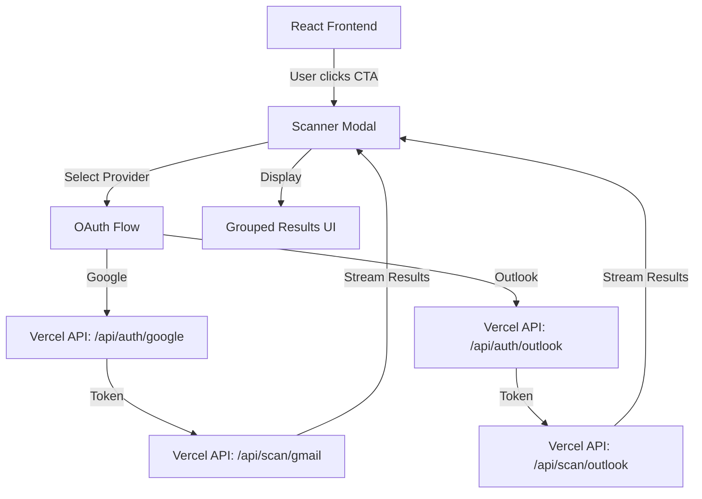

# Subscription Scanner Implementation Plan

## Overview
Integrate a real-time subscription scanner into the existing BobCorn React website using a modal/overlay approach. The scanner will use OAuth to access Gmail/Outlook inboxes and identify subscriptions without storing any user data.

## Architecture



## Technology Stack

### Frontend
- **React 18** (existing)
- **Tailwind CSS** (existing)
- **Vite** (existing)
- New: Modal component with progressive rendering

### Backend (Serverless)
- **Vercel Serverless Functions** (Node.js runtime)
- **googleapis** npm package for Gmail API
- **@microsoft/microsoft-graph-client** for Outlook API
- **In-memory session storage** (no database)

### APIs
- **Gmail API** - gmail.readonly scope
- **Microsoft Graph API** - Mail.Read scope

## Project Structure

```
/BobCorn
├── api/                          # Vercel serverless functions
│   ├── auth/
│   │   ├── google.js            # Gmail OAuth initiation
│   │   ├── google-callback.js   # Gmail OAuth callback
│   │   ├── outlook.js           # Outlook OAuth initiation
│   │   └── outlook-callback.js  # Outlook OAuth callback
│   ├── scan/
│   │   ├── gmail.js             # Gmail inbox scanning
│   │   └── outlook.js           # Outlook inbox scanning
│   └── utils/
│       ├── session.js           # In-memory session management
│       ├── classifier.js        # Subscription classification logic
│       └── known-services.js    # Lookup table of ~200 services
├── src/
│   ├── components/
│   │   ├── scanner/
│   │   │   ├── ScannerModal.jsx        # Main modal container
│   │   │   ├── ProviderSelection.jsx   # OAuth provider buttons
│   │   │   ├── ScanningProgress.jsx    # Live progress indicator
│   │   │   ├── ResultsDisplay.jsx      # Grouped results view
│   │   │   ├── SubscriptionCard.jsx    # Individual subscription card
│   │   │   └── useScannerState.js      # State management hook
│   │   └── [existing components...]
│   └── [existing files...]
├── .env.local                    # OAuth credentials (gitignored)
├── vercel.json                   # Vercel configuration
└── [existing files...]
```

## Implementation Phases

### Phase 1: Project Setup & Dependencies
**Goal:** Configure project for OAuth and API integration

**Tasks:**
1. Install backend dependencies:
   ```bash
   npm install googleapis @microsoft/microsoft-graph-client
   npm install uuid jsonwebtoken
   ```

2. Create `.env.local` file structure:
   ```env
   GOOGLE_CLIENT_ID=your_client_id
   GOOGLE_CLIENT_SECRET=your_client_secret
   GOOGLE_REDIRECT_URI=http://localhost:3000/api/auth/google-callback
   
   MICROSOFT_CLIENT_ID=your_client_id
   MICROSOFT_CLIENT_SECRET=your_client_secret
   MICROSOFT_REDIRECT_URI=http://localhost:3000/api/auth/outlook-callback
   
   SESSION_SECRET=random_secret_key
   ```

3. Create `vercel.json` for serverless function configuration

4. Add `.env.local` to `.gitignore`

### Phase 2: Serverless API Structure
**Goal:** Set up Vercel serverless functions for OAuth and scanning

**Files to create:**
- `/api/auth/google.js` - Initiate Gmail OAuth
- `/api/auth/google-callback.js` - Handle OAuth callback
- `/api/auth/outlook.js` - Initiate Outlook OAuth
- `/api/auth/outlook-callback.js` - Handle OAuth callback
- `/api/scan/gmail.js` - Scan Gmail inbox
- `/api/scan/outlook.js` - Scan Outlook inbox
- `/api/utils/session.js` - Session management
- `/api/utils/classifier.js` - Classification logic
- `/api/utils/known-services.js` - Service lookup table

### Phase 3: Gmail OAuth Implementation
**Goal:** Complete Gmail OAuth 2.0 flow

**OAuth Flow:**
1. User clicks "Sign in with Google"
2. Frontend calls `/api/auth/google`
3. API generates OAuth URL with state parameter (CSRF protection)
4. User redirects to Google consent screen
5. Google redirects to `/api/auth/google-callback?code=...&state=...`
6. API exchanges code for access token
7. Store token in session (in-memory, keyed by session ID)
8. Return session ID to frontend
9. Frontend stores session ID in memory (not localStorage)

**Key Features:**
- Read-only scope: `https://www.googleapis.com/auth/gmail.readonly`
- CSRF protection via state parameter
- Token refresh handling
- Error handling for denied consent

### Phase 4: Outlook OAuth Implementation
**Goal:** Complete Microsoft OAuth 2.0 flow

**OAuth Flow:**
Similar to Gmail but using Microsoft Graph API:
1. User clicks "Sign in with Outlook"
2. Frontend calls `/api/auth/outlook`
3. API generates OAuth URL with state parameter
4. User redirects to Microsoft consent screen
5. Microsoft redirects to `/api/auth/outlook-callback`
6. Exchange code for access token
7. Store in session
8. Return session ID

**Key Features:**
- Read-only scope: `Mail.Read`
- Microsoft Graph API integration
- Support for personal and work accounts

### Phase 5: Inbox Scanning - Layer 1 (Search Queries)
**Goal:** Implement server-side search to find subscription emails

**Gmail Search Query:**
```javascript
const query = 'has:unsubscribe (subject:invoice OR subject:receipt OR subject:billing OR subject:subscription OR subject:"your plan" OR subject:"your order")';
```

**Outlook Search Query:**
```javascript
const filter = "contains(subject,'invoice') or contains(subject,'receipt') or contains(subject,'billing') or contains(subject,'subscription')";
```

**Implementation:**
- Single API call per provider
- Returns only message IDs (fast)
- Typically 50-300 results even for large inboxes

### Phase 6: Inbox Scanning - Layer 2 (Two-Phase Fetching)
**Goal:** Fetch metadata efficiently without full email bodies

**Phase 1: Fetch IDs**
- Already done in Layer 1

**Phase 2: Batch Metadata Fetch**
- Gmail: Use `format=metadata` with `metadataHeaders=['From', 'Subject', 'Date']`
- Outlook: Request only specific fields
- Batch requests (100 at a time for Gmail, 20 for Outlook)
- Never fetch full body unless user explicitly requests

**Data Structure:**
```javascript
{
  id: 'message_id',
  from: 'sender@domain.com',
  subject: 'Your Netflix subscription',
  date: '2026-04-15T10:30:00Z',
  domain: 'netflix.com'
}
```

### Phase 7: Inbox Scanning - Layer 3 (Deduplication)
**Goal:** Group emails by sender domain and keep most recent

**Algorithm:**
1. Extract domain from sender email
2. Group all messages by domain
3. For each domain, keep only the most recent message
4. Reduces ~200 results to ~30 unique senders

**Implementation:**
```javascript
function deduplicateByDomain(messages) {
  const domainMap = new Map();
  
  for (const msg of messages) {
    const domain = extractDomain(msg.from);
    const existing = domainMap.get(domain);
    
    if (!existing || new Date(msg.date) > new Date(existing.date)) {
      domainMap.set(domain, msg);
    }
  }
  
  return Array.from(domainMap.values());
}
```

### Phase 8: Inbox Scanning - Layer 4 (Classification)
**Goal:** Classify subscriptions into confidence tiers

**Tier 1 - Known Services (High Confidence):**
- Lookup against hardcoded table of ~200 known domains
- Can display logo and service name
- Examples: netflix.com, spotify.com, adobe.com

**Tier 2 - Likely Paid (Medium Confidence):**
- No domain match, but subject/sender contains payment signals
- Keywords: invoice, receipt, payment, billing, €, $, USD, amount
- Regex patterns for currency and amounts

**Tier 3 - Free/Newsletter (Low Confidence):**
- Matched `has:unsubscribe` but no payment signals
- Likely newsletter or free plan

**Classification Function:**
```javascript
function classifySubscription(message, knownServices) {
  const domain = extractDomain(message.from);
  
  // Tier 1: Known service
  if (knownServices.has(domain)) {
    return {
      tier: 1,
      confidence: 'high',
      service: knownServices.get(domain),
      ...message
    };
  }
  
  // Tier 2: Payment signals
  const paymentKeywords = /invoice|receipt|payment|billing|€|\$|USD|amount/i;
  if (paymentKeywords.test(message.subject)) {
    return {
      tier: 2,
      confidence: 'medium',
      service: { name: domain, logo: null },
      ...message
    };
  }
  
  // Tier 3: Newsletter/free
  return {
    tier: 3,
    confidence: 'low',
    service: { name: domain, logo: null },
    ...message
  };
}
```

### Phase 9: Known Services Lookup Table
**Goal:** Create comprehensive list of ~200 subscription services

**Structure:**
```javascript
const knownServices = new Map([
  ['netflix.com', { name: 'Netflix', logo: 'netflix-logo-url', category: 'streaming' }],
  ['spotify.com', { name: 'Spotify', logo: 'spotify-logo-url', category: 'music' }],
  ['adobe.com', { name: 'Adobe Creative Cloud', logo: 'adobe-logo-url', category: 'software' }],
  // ... ~200 more entries
]);
```

**Categories:**
- Streaming (Netflix, Disney+, HBO Max, etc.)
- Music (Spotify, Apple Music, YouTube Music, etc.)
- Software (Adobe, Microsoft 365, Notion, etc.)
- Cloud Storage (Dropbox, iCloud, Google One, etc.)
- Fitness (Peloton, ClassPass, etc.)
- News/Media (NYT, WSJ, Medium, etc.)

### Phase 10: Progressive Rendering System
**Goal:** Stream results to frontend as they arrive

**Implementation:**
- Use Server-Sent Events (SSE) or chunked responses
- Process and send results in batches
- Frontend updates UI in real-time

**Flow:**
1. Start scanning
2. Process first page of results (up to 100 messages)
3. Classify and send to frontend
4. Frontend renders first batch
5. Continue with next page in background
6. Stream additional results as they're processed

**API Response Format:**
```javascript
// Streaming response
data: {"type":"progress","found":5,"total":150}
data: {"type":"result","subscription":{...}}
data: {"type":"result","subscription":{...}}
data: {"type":"complete","totalFound":32}
```

### Phase 11: React Modal Component
**Goal:** Create full-screen overlay for scanner interface

**Component Structure:**
```jsx
<ScannerModal isOpen={isOpen} onClose={onClose}>
  {!authenticated && <ProviderSelection onSelect={handleProviderSelect} />}
  {scanning && <ScanningProgress progress={progress} found={found} />}
  {results && <ResultsDisplay results={results} />}
</ScannerModal>
```

**Features:**
- Full-screen overlay with backdrop
- Escape key to close
- Smooth transitions
- Responsive design
- Matches existing brutal design system

### Phase 12: OAuth Provider Selection UI
**Goal:** Create provider selection screen

**Design:**
- Two large buttons: "Sign in with Google" and "Sign in with Outlook"
- Clear explanation of permissions
- Privacy assurance messaging
- Matches existing design system (brutal borders, acid/blood colors)

**Copy:**
- "Choose your email provider"
- "We'll scan for subscriptions with read-only access"
- "No passwords. No storage. No tracking."

### Phase 13: Scanning Progress Indicator
**Goal:** Show live scanning progress with found subscriptions

**Features:**
- Animated progress bar or spinner
- Live counter: "Scanning your inbox... Found so far: 12 subscriptions"
- List of services found in real-time (Netflix, Spotify, Adobe...)
- Estimated time remaining
- Cancel button

**Design:**
- Matches brutal design system
- Uses existing color palette
- Smooth animations

### Phase 14: Results Display UI
**Goal:** Show grouped, categorized results

**Three Sections:**
1. **Paid Subscriptions** (Tier 1 + Tier 2)
   - High confidence services
   - Sorted by most recent
   - Show service logo if available

2. **Newsletters & Free Plans** (Tier 3)
   - Lower confidence
   - Likely free services

3. **Unclassified** (Low signal)
   - Matched search but unclear
   - User can manually review

**Layout:**
- Grid or list view
- Filter/sort options
- Search within results

### Phase 15: Subscription Card Component
**Goal:** Display individual subscription details

**Card Content:**
- Service name/logo (if known)
- Sender email
- Date of most recent email
- Subject line preview
- "View details" button (fetches full body on-demand)

**Actions:**
- View full email body
- Open unsubscribe link (if available)
- Mark as not a subscription

**Design:**
- Matches existing brutal card style
- Border, shadow, hover effects
- Responsive

### Phase 16: Integration with Existing Site
**Goal:** Add modal triggers to CTA buttons

**Trigger Points:**
1. Hero CTA: "Try the Scanner"
2. Subscription Auditor section: "Start free trial"
3. Pricing section: "Get started"
4. Demo section: "Run the demo"

**Implementation:**
```jsx
// In existing components
import { useScannerModal } from './scanner/useScannerState';

function Hero() {
  const { openScanner } = useScannerModal();
  
  return (
    <button onClick={openScanner} className="btn-primary">
      Try the Scanner
    </button>
  );
}
```

### Phase 17: Environment Variables Configuration
**Goal:** Set up OAuth credentials securely

**Files:**
- `.env.local` (local development, gitignored)
- Vercel environment variables (production)

**Required Variables:**
- `GOOGLE_CLIENT_ID`
- `GOOGLE_CLIENT_SECRET`
- `GOOGLE_REDIRECT_URI`
- `MICROSOFT_CLIENT_ID`
- `MICROSOFT_CLIENT_SECRET`
- `MICROSOFT_REDIRECT_URI`
- `SESSION_SECRET`

**Setup Instructions:**
1. Create Google Cloud Console project
2. Enable Gmail API
3. Create OAuth 2.0 credentials
4. Create Azure App Registration
5. Configure Microsoft Graph API permissions
6. Add redirect URIs for both providers

### Phase 18: Session Management
**Goal:** Secure, in-memory session handling

**Implementation:**
```javascript
// In-memory store (resets on server restart)
const sessions = new Map();

function createSession(userId, token) {
  const sessionId = generateSecureId();
  sessions.set(sessionId, {
    userId,
    token,
    createdAt: Date.now(),
    expiresAt: Date.now() + (60 * 60 * 1000) // 1 hour
  });
  return sessionId;
}

function getSession(sessionId) {
  const session = sessions.get(sessionId);
  if (!session || session.expiresAt < Date.now()) {
    sessions.delete(sessionId);
    return null;
  }
  return session;
}

// Cleanup expired sessions every 5 minutes
setInterval(() => {
  const now = Date.now();
  for (const [id, session] of sessions.entries()) {
    if (session.expiresAt < now) {
      sessions.delete(id);
    }
  }
}, 5 * 60 * 1000);
```

**Security:**
- Sessions expire after 1 hour
- Tokens never sent to frontend
- Session IDs are cryptographically secure
- CSRF protection via state parameter

### Phase 19: Error Handling
**Goal:** Graceful error handling and user feedback

**Error Types:**
1. **OAuth Errors:**
   - User denied consent
   - Invalid credentials
   - Expired token

2. **API Errors:**
   - Rate limiting
   - Network failures
   - Invalid responses

3. **Scanning Errors:**
   - Empty inbox
   - No subscriptions found
   - Partial results

**User Feedback:**
- Clear error messages
- Retry options
- Help/support links
- Fallback UI states

### Phase 20-22: Testing
**Goal:** Comprehensive testing of all flows

**Test Cases:**
1. **Gmail OAuth:**
   - Successful authentication
   - Denied consent
   - Token refresh
   - Expired session

2. **Outlook OAuth:**
   - Personal account
   - Work account
   - Denied consent

3. **Inbox Scanning:**
   - Small inbox (<100 emails)
   - Large inbox (>10,000 emails)
   - No subscriptions found
   - Many subscriptions (>50)

4. **Classification:**
   - Known services correctly identified
   - Payment signals detected
   - Newsletters classified correctly

5. **UI/UX:**
   - Modal opens/closes correctly
   - Progress updates in real-time
   - Results display properly
   - Responsive on mobile

### Phase 23: Performance Optimization
**Goal:** Handle large inboxes efficiently

**Optimizations:**
1. **Pagination:**
   - Process 100 messages at a time
   - Stream results progressively
   - Don't wait for all results

2. **Caching:**
   - Cache known service lookups
   - Memoize classification results

3. **Batching:**
   - Batch API requests (Gmail: 100, Outlook: 20)
   - Parallel processing where possible

4. **Lazy Loading:**
   - Only fetch full email body on user request
   - Defer image loading

### Phase 24: Security Measures
**Goal:** Protect user data and prevent attacks

**Security Features:**
1. **CSRF Protection:**
   - State parameter in OAuth flow
   - Validate state on callback

2. **Token Security:**
   - Never expose tokens to frontend
   - Store in memory only (no database)
   - Automatic expiration

3. **Input Validation:**
   - Sanitize all user inputs
   - Validate session IDs
   - Rate limiting on API endpoints

4. **HTTPS Only:**
   - Enforce HTTPS in production
   - Secure cookies (httpOnly, secure, sameSite)

### Phase 25: Deployment Configuration
**Goal:** Deploy to Vercel with proper configuration

**vercel.json:**
```json
{
  "functions": {
    "api/**/*.js": {
      "memory": 1024,
      "maxDuration": 30
    }
  },
  "env": {
    "NODE_ENV": "production"
  }
}
```

**Deployment Steps:**
1. Connect GitHub repo to Vercel
2. Configure environment variables in Vercel dashboard
3. Update OAuth redirect URIs to production URLs
4. Deploy and test
5. Monitor logs for errors

## Known Limitations & Considerations

1. **Gmail and Outlook Only:**
   - Other providers (Yahoo, ProtonMail) not supported
   - No equivalent OAuth + search APIs

2. **May Miss Old Subscriptions:**
   - If only email is years old and not indexed
   - Search queries have limitations

3. **Can't Detect Cash Payments:**
   - No email trail = not detected
   - In-person subscriptions won't appear

4. **Newsletter vs Subscription:**
   - Hard to distinguish without payment signals
   - May have false positives

5. **Apple Hide My Email:**
   - Aliases like `xyz@privaterelay.appleid.com`
   - Sender domain is unresolvable

6. **User Trust:**
   - Must trust app with inbox read access
   - Standard OAuth consent, but still friction

## Success Metrics

1. **Performance:**
   - Scan completes in <5 seconds for typical inbox
   - First results appear in <2 seconds
   - Handles 10,000+ email inboxes

2. **Accuracy:**
   - >90% of known services correctly identified
   - <5% false positives in Tier 1
   - <10% false negatives (missed subscriptions)

3. **User Experience:**
   - OAuth flow completes in <30 seconds
   - Modal loads in <1 second
   - Responsive on all devices

4. **Security:**
   - No data breaches
   - No token leaks
   - CSRF protection working

## Next Steps

After reviewing this plan:
1. Confirm OAuth app registration status
2. Review and approve the implementation approach
3. Switch to Code mode to begin implementation
4. Start with Phase 1 (Project Setup)

## Questions for Clarification

1. Do you have Google Cloud Console and Azure accounts ready?
2. Should we include a "demo mode" with mock data for users who don't want to connect their email?
3. Any specific design preferences for the modal beyond matching the existing brutal style?
4. Should we add analytics to track usage (privacy-respecting)?